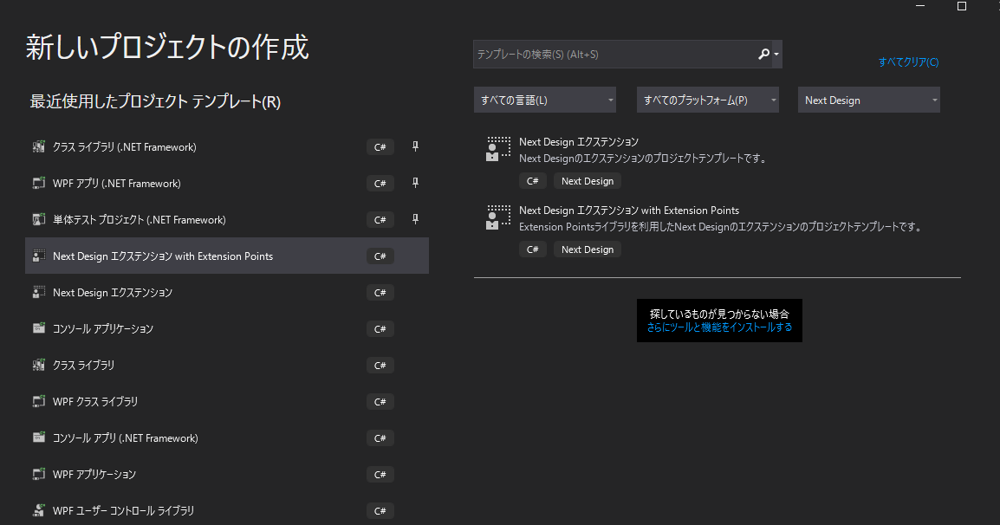

# Next Design Extension Project Templates

## 概要
* Next Designのエクステンション開発のためのプロジェクトテンプレートです。
* dotnetのCLIおよび、Visual Studioで利用できます。
* [Nuget.orgで公開](https://www.nuget.org/packages/NextDesign.Extension.ProjectTemplates/)しています。
* コマンドラインツール [NDExt](https://www.nuget.org/packages/NDExt/)を利用すると便利です。

## インストール方法
* コマンドプロンプトより次のように実行して下さい。

```
> dotnet new --install NextDesign.Extension.ProjectTemplates
```

正常にインストールが完了している場合は次のコマンドを実行すると

```
> dotnet new 
```

このように表示されます。

```
Templates                                     Short Name           Language    Tags
--------------------------------------------  -------------------  ----------  ----------------------
Console Application                           console              [C#],F#,VB  Common/Console
...
Next Design エクステンション with Extension Points    ndextp               [C#]        Next Design
Next Design エクステンション                          ndext                [C#]        Next Design
...

```

## 利用方法

* 次のように実行するとエクステンションのプロジェクトを作成できます。

```
> dotnet new ndext -n MyExt1
```

* また、よりシンプルにエクステンションの開発が可能な、[NextDesign.Desktop.ExtensionPoints](https://www.nuget.org/packages/NextDesign.Desktop.ExtensionPoints/)を利用したエクステンションのプロジェクトも作成可能です。

```
> dotnet new ndextp -n MyExt2
```

* また、Visual Studioの新規プロジェクト作成のダイアログでも作成可能です。



## パッケージのアンインストール方法

```
> dotnet new  --uninstall
```

と実行すると、下記のように表示されます。`Uninstall Command`で記載されているコマンドを実行して下さい。

```
  NextDesign.Extension.ProjectTemplates
    Details:
      NuGetPackageId: NextDesign.Extension.ProjectTemplates
      Version: 0.6.7
      Author: DENSO CREATE INC.
    Templates:
      Next Design エクステンション (ndext) C#
      Next Design エクステンション with Extension Points (ndextp) C#
    Uninstall Command:
      dotnet new -u NextDesign.Extension.ProjectTemplates
```


## nuget.orgへのパッケージの公開方法


### ローカルから公開する方法
1. 事前準備
   * nuget.orgで `densocreate`の組織に所属するアカウントを登録して下さい。
   * nuget.orgの管理ページからApiキーを取得し、環境変数 `NUGET_APIKEY` をセットして下さい。
2. 公開
   * `publish.cmd`を実行して下さい。

### gihtubから公開する方法
* Github Actionsで公開予定。


